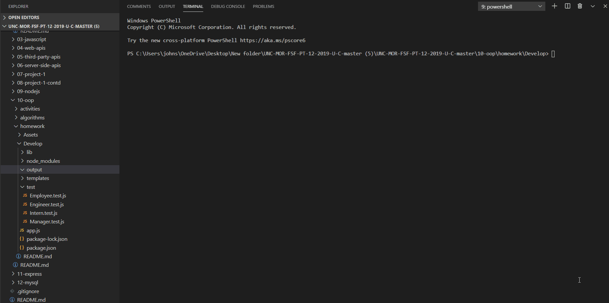

# teamgenerator
UNC Project

 &nbsp;&nbsp;&nbsp; 	  &nbsp;&nbsp;&nbsp; 	  

## Description  

  * This is a command line application for building and displaying a software engineering team. 
 
## Installation  

  * Clone this repository from Github and then enter the command 'npm i' to install the necessary dependencies. 

* Node.js
* Inquirer - npm package for asking questions on the command line
* Path - module for interacting with the file system
* FS - module for reading and writing to files
* CSS
* Bootstrap Framework
* HTML
